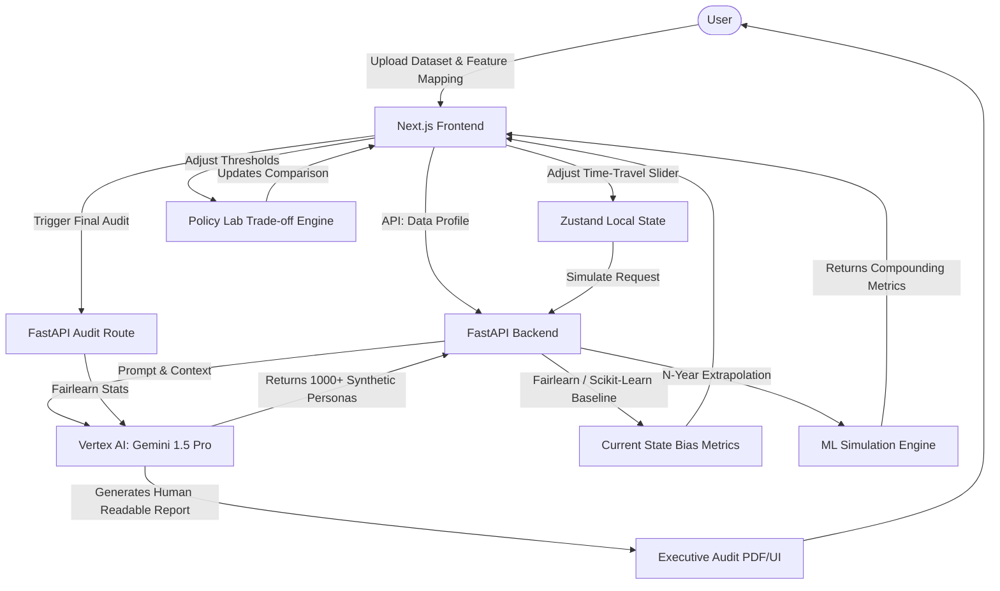

# DecisionTwin: Comprehensive System Overview

## 1. Core Concept & Mission
**DecisionTwin** is a proactive simulation platform designed to eliminate "Invisible Bias" in AI models. By creating a "Digital Twin" of decision-making environments, stakeholders (FinTech, HR, Compliance) can simulate up to 10 years into the future to observe how seemingly benign algorithms might compound bias over time.

## 2. Technical Architecture & Tech Stack

### Frontend (User Interface & Visualization)
*   **Framework:** Next.js (React)
*   **Styling & UI:** Tailwind CSS, Tremor.so (Dashboards/Charts), Shadcn/UI (glass-and-glow aesthetics, dark mode)
*   **State Management:** Zustand (Client-side simulation state), TanStack Query (Server-side data fetching)
*   **Typography:** Inter / Plus Jakarta Sans (UI) & JetBrains Mono / Geist Mono (Data parsing)
*   **Deployment:** Firebase Hosting

### Backend (ML Processing & Simulation)
*   **Framework:** FastAPI (Python)
*   **Machine Learning Ecosystem:** Pandas (Data manipulation), Scikit-Learn (Modeling), Fairlearn (Bias metrics)
*   **AI Integration:** Gemini 1.5 Pro via Vertex AI (for Synthetic Data Generation and Forensic Executive Reports)
*   **Deployment:** Google Cloud Run (Containerized via Docker)

## 3. High-Level Flow Visualization

## 4. Execution Roadmap (48-Hour Plan)
1.  **Phase 1:** Foundation & Deployment (Next.js + Tailwind + Tremor setup; FastAPI basic health check endpoint).
2.  **Phase 2:** AI Synthetic Data Generation (Vertex AI Gemini 1.5 Pro JSON streaming of personas).
3.  **Phase 3:** Core ML/Bias Logic (Scikit-Learn modeling + Fairlearn metrics).
4.  **Phase 4:** Data Visualization UI & State Hookup (React Query + Zustand for real-time visualization updates).
5.  **Phase 5:** AI Executive Reporting & Polish (Gemini narrative generation, final UI tweaks).

## 5. UI/UX Guiding Principles
*   **Dark Mode Native:** Deep space backgrounds (`zinc-950/900`) layered with semantic colors: Trust Emerald, Alert Amber, Critical Crimson.
*   **Interactivity:** Smooth micro-interactions, responsive time-travel slider with debounced API calls.
*   **Transparency:** All bias flags lead to explainability metrics.
