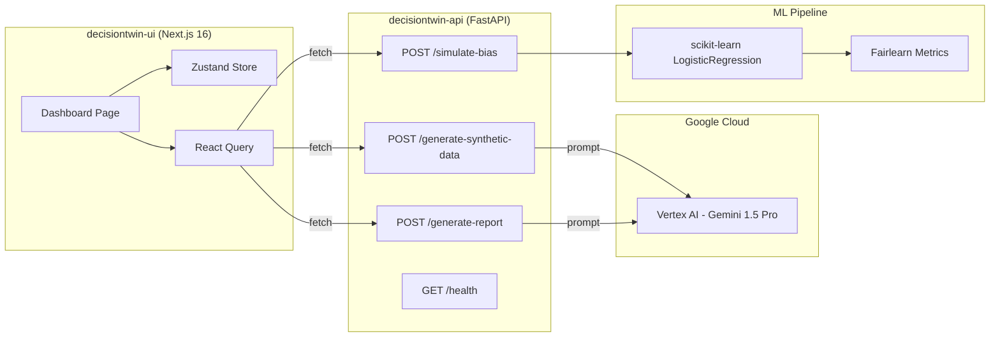

# DecisionTwin — Current Working Features & Tech Stack

## Tech Stack

### Backend (`decisiontwin-api/`)

| Layer | Technology | Version / Notes |
|---|---|---|
| **Language** | Python 3.11 | via Docker `python:3.11-slim` |
| **Framework** | FastAPI | REST API with Pydantic models |
| **Server** | Uvicorn | ASGI, hot-reload in dev |
| **AI / LLM** | Google Vertex AI — Gemini 1.5 Pro | `gemini-1.5-pro-preview-0409` |
| **ML** | scikit-learn | `LogisticRegression` for bias simulation |
| **Fairness** | Fairlearn | Demographic parity metrics |
| **Data** | Pandas | DataFrame processing |
| **Containerization** | Docker | Single-stage Dockerfile, port 8080 |

### Frontend (`decisiontwin-ui/`)

| Layer | Technology | Version |
|---|---|---|
| **Framework** | Next.js | 16.2.4 (App Router) |
| **Language** | TypeScript | ^5 |
| **UI Library** | React | 19.2.4 |
| **Styling** | Tailwind CSS v4 | with `@tailwindcss/postcss` |
| **Charts/UI** | Tremor | ^3.18.7 (imported but unused so far) |
| **Icons** | Lucide React | ^1.8.0 |
| **State Management** | Zustand | ^5.0.12 |
| **Data Fetching** | TanStack React Query | ^5.99.1 |
| **Font** | Inter (Google Fonts) | via `next/font` |

### Infrastructure

| Concern | Approach |
|---|---|
| **Deployment** | Docker (API), Next.js standalone (UI) |
| **Cloud** | Google Cloud Platform (Vertex AI project: `decisiontwin-hackathon`) |
| **CORS** | Fully open (`*`) for hackathon dev |

---

## Currently Working Features

### ✅ 1. Synthetic Persona Generation — `POST /generate-synthetic-data`

- Generates up to N synthetic individuals with traits: `age_group`, `gender`, `race`, `income`, `credit_score`
- **Gemini-powered path**: sends a crafted prompt to Gemini 1.5 Pro requesting diverse, intersectional synthetic data as JSON
- **Mock fallback path**: deterministic generation when Vertex AI is unavailable
- Persists output to `mock_personas.json` for downstream simulation
- Frontend auto-triggers this on page load

### ✅ 2. Bias Simulation Engine — `POST /simulate-bias`

This is the core "Decision Twin" logic:

- Loads persona data and flattens traits into a Pandas DataFrame
- User selects a **sensitive feature** to track (`gender`, `race`, or `age_group`)
- Simulates **compounding feedback loops** over N years:
  - Marginalized group (label `0`) receives an increasing credit-score penalty of **4 points per simulated year**
  - This models real-world systemic drift where disadvantaged groups accumulate worse outcomes over time
- Trains a `LogisticRegression` classifier on the biased synthetic targets
- Computes fairness metrics via **Fairlearn**:
  - `demographic_parity_difference`
  - `demographic_parity_ratio`
  - Overall approval rate
- Returns **bias flags** with severity (`High` if ratio < 0.80 — the legal "80% Rule")

### ✅ 3. AI-Powered Forensic Report — `POST /generate-report`

- Takes simulation metrics as input
- **Gemini path**: prompts Gemini 1.5 Pro to act as an AI Ethics consultant and produce a 1-paragraph executive summary of systemic risk
- **Mock path**: returns a structured template report when AI is unavailable
- Displayed in the UI's "Gemini 1.5 Pro Forensic Summary" panel

### ✅ 4. Interactive Dashboard (Single-Page App)

The frontend is a single dark-mode dashboard with:

| Element | What It Does |
|---|---|
| **Sensitive Feature Selector** | Dropdown to pick `Gender`, `Race`, or `Age Group` — re-runs simulation on change |
| **Time-Travel Slider** | Range 1–10 years — simulates compounding bias drift in real-time |
| **Policy Intervention Slider** | Threshold tilt (-50 to +50) — injects "What-If" policy changes to see trade-offs |
| **Systemic Disparate Impact KPI** | Shows `demographic_parity_ratio` with color coding (red < 0.80, green ≥ 0.80) |
| **Demographic Parity Diff KPI** | Shows the raw disparity variance |
| **Global Approval Rate KPI** | Shows overall model approval % (proxy for "profit") |
| **Bias Flag Cards** | Severity-coded alerts with compliance violation descriptions |
| **Gemini Forensic Summary** | Live AI-generated narrative explaining the simulation findings |
| **Status Indicator** | Header badge showing Gemini sync status + loading spinner |

### ✅ 5. Glassmorphism Design System

- Custom `.glass-card` component with blur + transparency
- Hover glow effects (blue border + box-shadow)
- Pulsing animation on the timeline slider thumb
- Dark forensic aesthetic (`zinc-950` background)

### ✅ 6. Health Check — `GET /health`

- Returns API status + whether Vertex AI is active

### ✅ 7. Multi-Page Architecture

- Fully featured Next.js App Router setup with deep linking.
- New routes added: `/ingest`, `/policy-lab`, `/compare`, `/reports`.
- Global Navigation bar syncing active states.

### ✅ 8. Data Ingestion Sandbox — `POST /ingest-data`

- Drag-and-drop interface supporting CSV, JSON, and Parquet.
- Client-side pre-validation using Web Workers with schema detection and missing value detection.
- Converts to unified persona format for downstream simulations.

### ✅ 9. Multi-Model Comparison Engine — `POST /simulate-all-models`

- Allows users to benchmark fairness vs. performance across multiple algorithmic models simultaneously.
- Supported algorithms: Logistic Regression, Random Forest, Decision Tree.
- Generates performance matrices visualizing accuracy drop-offs when enforcing strict fairness constraints.

### ✅ 10. Advanced Visualizations (Recharts)

- Replaced placeholder stats with high-fidelity `recharts` implementations.
- Features Longitudinal Drift Line Charts, Trade-off Bar Matrices, and Multi-model Performance Radar charts.

### ✅ 11. Historical Simulations & Export Generation

- Complete historical logging of simulations in the `/reports` route.
- Interactive export to CSV (raw statistical metrics) or PDF (full executive AI Ethics Audit reports).

---

## What's NOT Built Yet (from DOCS/)

These originally requested features were **intentionally omitted** as per implementation specifications (to avoid third-party cloud locking or unnecessary complexity):

| Planned Feature | Status |
|---|---|
| Firebase / Firestore persistence | ❌ Omitted (using local file/memory for Hackathon speed) |
| Google Cloud Run deployment | ❌ Omitted (deploying via simpler standalone methods) |
| User authentication | ❌ Omitted |
| Persona Explorer (individual persona drill-down) | ❌ Not built |

---

## Architecture Diagram

